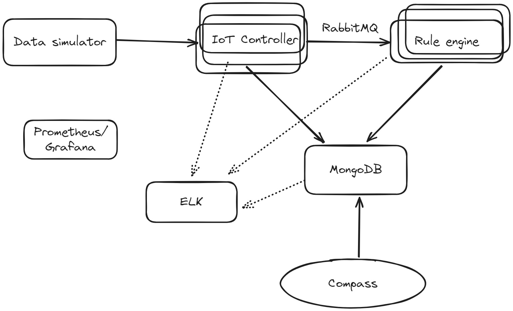

# Разработка простого IoT сервиса
<p><b>Цель</b>: отработка принципов и подходов к разработке современных многоуровневых сервисов при решении практической задачи.</p>
<p><b>Задача</b>: Разработать простое IoT решение и показать применение основных принципов разработки, которые обсуждались на лекции.</p>
<p>Примерная структура решения, которое необходимо разработать:</p>



## Компоненты системы
<ol>
  <li>IoT контроллер - сервис, который принимает входные пакеты с данными от «устройств», подключенных к системе. Принимаемые пакеты валидируются и сохраняются в базу данных MongoDB.</li>
  <li>Rule engine - простой обработчик правил. Должен уметь обрабатывать мгновенные правила, т.е. основанные на конкретном пакете, и длящиеся, основанные на нескольких пакетах. Пакеты для обработки компонент получает от IoT контроллера через очередь сообщений.
  <ul>
    <li>Мгновенное правило - Значение поля А от устройства 42 больше 5.</li>
    <li>Длящееся правило - Значение поля А от устройства 42 больше 5 на протяжении 10 пакетов от этого устройства.</li>
  </ul>
  </li>
  <li>Data simulator - Простой генератор данных для разрабатываемого IoT решения. Позволяет указать количество симулируемых устройств и частоту сообщений, которые генерируются каждым из них. Например, 100 устройств и 1 сообщение в секунду с устройства.</li>
</ol>

## Дополнительные компоненты
<ol>
  <li>MongoDB - база данных, в которой хранятся IoT сообщения и отметки (например, алёрты) о срабатываниях правил, которые заложены в Rule Engine</li>
  <li>Compass - приложение для просмотра содержимого базы данных MongoDB, будет использоваться вместо пользовательского интерфейса приложения.</li>
  <li>RabbitMQ - очередь сообщений для обмена данными между IoT Контроллером и Rule Engine</li>
  <li>Postgres/Graphana - система для сбора и мониторинга метрик о работе приложения</li>
  <li>ELK Stack - система для сбора и просмотра логов разрабатываемого решения.</li>
</ol>

<p>При выполнении работы можно использовать любой удобный язык программирования. Желательно выполнять работу на чистом Docker окружении, чтобы максимально разобраться в том, как работают компоненты на низком уровне.</p>

## Содержание отчета
<ol>
  <li>Отчёт должен содержать полное описание архитектуры разрабатываемого приложения со всеми допущениями и дополнениями технического задания этой работы.</li>
  <li>В отчёте необходимо рассмотреть применение дизайн принципов, рассмотренных на лекции, а также гипотетическую применимость. Т.е. если тот или иной принцип не может быть применён в силу простоты разрабатываемого решения, как он мог бы быть применён, если бы решение было бы больше или сложнее в том или ином отношении.</li>
</ol>

# Принцип работы проекта
## Компоненты системы

### 1. **Elasticsearch**
- **Роль:** Хранение и индексация логов и данных.
- **Принцип работы:**
  - Логи от `iot-controller` и `rule-engine` отправляются через `Logstash` в `Elasticsearch`.
  - Elasticsearch упрощает поиск и анализ логов благодаря мощному поисковому движку.

---

### 2. **Logstash**
- **Роль:** Сбор и обработка логов.
- **Принцип работы:**
  - Получает логи от `iot-controller` и `rule-engine` через указанный порт (обычно `5228`).
  - Обрабатывает логи (например, фильтрация, парсинг) и отправляет их в `Elasticsearch`.

---

### 3. **Kibana**
- **Роль:** Визуализация логов и данных.
- **Принцип работы:**
  - Интерфейс для Elasticsearch, позволяющий визуализировать и анализировать логи.
  - Вы можете отслеживать поступающие данные и ошибки.

---

### 4. **MongoDB**
- **Роль:** Хранение данных IoT.
- **Принцип работы:**
  - `iot-controller` сохраняет входящие данные от устройств (полученные от `data-simulator`) в коллекции `messages`.
  - `rule-engine` сохраняет результаты срабатывания правил в коллекции `alerts`.

---

### 5. **RabbitMQ**
- **Роль:** Очередь сообщений.
- **Принцип работы:**
  - `iot-controller` отправляет данные IoT в очередь `iot_data` после их валидации и сохранения в MongoDB.
  - `rule-engine` получает данные из этой очереди и обрабатывает их.

---

### 6. **Prometheus**
- **Роль:** Сбор метрик.
- **Принцип работы:**
  - Службы, такие как `iot-controller` и `rule-engine`, экспортируют метрики (например, количество обработанных пакетов).
  - Prometheus собирает эти метрики для анализа.

---

### 7. **Grafana**
- **Роль:** Визуализация метрик.
- **Принцип работы:**
  - Подключается к Prometheus и отображает собранные метрики в виде графиков и панелей мониторинга.
  - Например, отображает количество обработанных сообщений или задержку обработки.

---

### 8. **IoT Controller**
- **Роль:** Центральный компонент для приема данных от устройств.
- **Принцип работы:**
  - Получает данные через API (`/data`).
  - Валидирует данные (например, проверяет наличие `device_id`).
  - Сохраняет данные в MongoDB.
  - Отправляет данные в RabbitMQ для обработки.

---

### 9. **Rule Engine**
- **Роль:** Обработка данных и срабатывание правил.
- **Принцип работы:**
  - Получает данные из очереди RabbitMQ.
  - Применяет мгновенные правила (например, "значение поля A больше 5").
  - Применяет длящиеся правила, анализируя несколько пакетов (например, "значение поля A больше 5 в течение 10 сообщений").
  - Сохраняет срабатывания правил в MongoDB (в коллекцию `alerts`).

---

### 10. **Data Simulator**
- **Роль:** Генерация данных от устройств.
- **Принцип работы:**
  - Симулирует устройства (количество устройств указывается пользователем).
  - Отправляет данные в `iot-controller` через RabbitMQ.
  - Генерирует логи, чтобы отслеживать, какие данные отправляются.

---

## Общий поток данных

1. **Генерация данных:**
   - `data-simulator` генерирует пакеты данных (например, `{"device_id": 42, "field_a": 7}`) и отправляет их в очередь RabbitMQ.

2. **Обработка IoT Controller:**
   - `iot-controller` получает данные из RabbitMQ.
   - Валидирует и сохраняет их в MongoDB.
   - Отправляет данные обратно в RabbitMQ для обработки.

3. **Обработка Rule Engine:**
   - `rule-engine` получает данные из RabbitMQ.
   - Применяет правила:
     - Мгновенные: Проверяет каждое сообщение.
     - Длящиеся: Анализирует последовательность сообщений.
   - Сохраняет результаты (срабатывания правил) в MongoDB.

4. **Логи:**
   - Логи от `iot-controller` и `rule-engine` отправляются в `Logstash`.
   - `Logstash` передает их в `Elasticsearch`.
   - `Kibana` предоставляет интерфейс для анализа логов.

5. **Метрики:**
   - Метрики от `iot-controller` и `rule-engine` собираются Prometheus.
   - Grafana визуализирует их.

---

## Как проверить работу системы

1. **Kibana:**
   - Откройте интерфейс Kibana (по умолчанию: `http://localhost:5601`).
   - Проверьте логи и убедитесь, что данные поступают от `iot-controller` и `rule-engine`.

2. **MongoDB:**
   - Подключитесь к MongoDB и проверьте коллекции:
     - `messages` (данные IoT).
     - `alerts` (срабатывания правил).

3. **Prometheus и Grafana:**
   - Откройте Grafana (по умолчанию: `http://localhost:3000`).
   - Убедитесь, что метрики отображаются на панели мониторинга.

4. **RabbitMQ:**
   - Проверьте очередь `iot_data` в интерфейсе RabbitMQ (по умолчанию: `http://localhost:15672`).

5. **Консольные логи:**
   - Проверьте логи контейнеров `iot-controller`, `rule-engine` и `data-simulator`:
     ```bash
     docker logs <container_name>
     ```

---

## Пример сценария

1. Запустите систему.
2. Настройте `data-simulator` на генерацию данных от 10 устройств с 1 сообщением в секунду.
3. Проверьте:
   - Данные попадают в MongoDB (`messages`).
   - Срабатывают правила в `rule-engine` и добавляются в MongoDB (`alerts`).
   - Все логи доступны в Kibana.
   - Метрики видны в Grafana.

